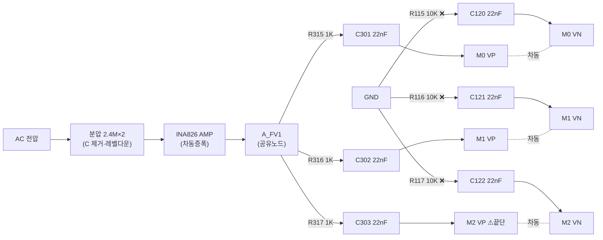
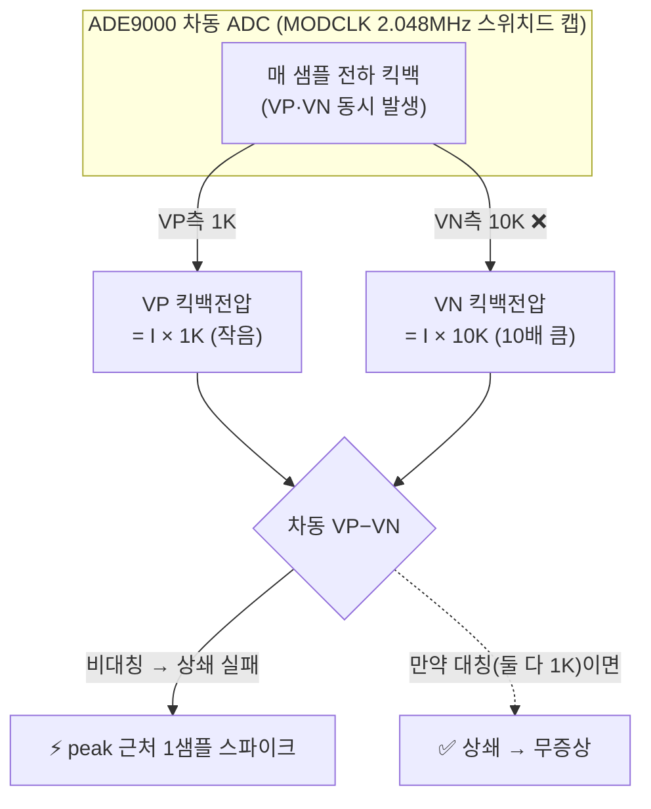

# SV300 ADE9000 리팩토링 작업 로그 (에이전트 위임 기록)

> 브랜치: `refactor/ade9000-bus-thread`
> 방식: 감독자(Claude)가 각 단계를 에이전트에 위임 → 결과 검증 → 커밋. 실기 검증은 사용자.
> 목표 구조: [ADE9000_단일스레드_전환설계.md](ADE9000_단일스레드_전환설계.md) §10
> 각 단계에 **에이전트에 전달한 지시 요지 + 에이전트 결과 + 감독자 검증**을 기록.

## 작업 단계 개요 (W1~W5)

| 단계 | 작업 | 의존 | 상태 |
|---|---|---|---|
| **W1** | `meter_scan`+`meter_scan_2` → 단일 `meter_scan(id)` 통합 | — | ✅ 완료·커밋(`7aa3569`) |
| **W3** | `Meter1/2_Task` → `Meter12_Task` 통합, IRQ 통보 단일화, app_main 수정 | W1 | ✅ 완료(검증됨, 커밋 대기) |
| **W2** | SSP 락 제거(`ssp1_mutex`/`wfb_mutex`/`burst`/`ssp1WfbLock`/`if(bus==1)`) | **W3** | ✅ 완료(검증됨, 커밋 대기) |
| **W4** | `checkPqEvent`+`pushEvent` → 신설 `PqEvt_Task` 위임, `fastRmsQ[]` 링 신설 | W3 | ⏳ 대기 |
| **W5** | `putFsQ` non-block화 + DMAMUX 부팅1회 분리 + 우선순위 재배치 | W2,W4 | ⏳ 대기 |

> **순서 조정**: 설계서엔 W2→W3이었으나 **안전 순서는 W3→W2**. 락을 먼저 제거하면 M1·M2가 아직 2스레드라 SSP1 경합이 노출됨. W3(스레드 통합)으로 경합을 없앤 뒤 W2(락 제거)가 안전.

## 확정된 설계 결정 (에이전트 공통 지침)

- 분할: **버스별 스레드** (M0=SSP0 → Meter0, M1·M2=SSP1 → Meter12)
- `meter_scan`/`meter_scan_2` → **단일 `meter_scan(id)`**
- Meter12 스캔: **옵션 A(둘 다 호출)**
- IRQ 통보: **단일 플래그(0x1) 통합** (M1·M2 모두 `tid_meter[1]` 0x1로 깨움)
- 이벤트 처리: **신설 PqEvt_Task 위임** + fast RMS 링 공급
- DMAMUX: **부팅 1회 분리**
- `putFsQ`: **non-blocking화**(drop+카운터)
- Meter12 우선순위: **REALTIME 동급**

---

## W1 — meter_scan 통합 ✅

### 에이전트에 전달한 지시 (요지)
- `meter_scan_2` 삭제 → 단일 `meter_scan(uint8_t id)`로 통합. 호출처(Meter1/2_Task)를 `meter_scan(id)`로 교체(Task 자체는 W3에서).
- 통합 규칙: ZX 타임아웃 `id==0?20:METER_SCAN2_ZX_TMO_MS(50)`, LED 토글 `if(id==0)`(bit0), **RR+슬라이스 부하분산 완전 제거**(bit19·bit21 조건 없이 매번), 나머지 로직 기존 유지.
- 삭제: `m12_pq_rr_owner`, `m12_pq_slice[]`. `METER_SCAN2_ZX_TMO_MS`는 유지.
- 제약: SSP 락·스레드 통합 건드리지 말 것(W2/W3). ade9000.c/meter.c/헤더만. Keil이라 컴파일 불가 → 문법·심볼 정합성 자체 검토.

### 에이전트 결과
- **ade9000.c**: `meter_scan_2()` 삭제·통합. `AD9X_PQM_STAT0_SLICED`·`m12_pq_slice[]`·`m12_pq_rr_owner` 삭제. `METER_SCAN2_ZX_TMO_MS`(50) 유지.
- **meter.c**: Meter1_Task(5306)·Meter2_Task(5339) 호출을 `meter_scan(id)`로 교체. Meter0_Task는 원래부터 `meter_scan` — 무변경. Task 함수 자체는 W3 대상이라 미변경.
- 헤더: `meter_scan_2` 프로토타입은 애초에 없었음. `ade9000.h:621` `meter_scan` 선언 유지.
- 판단: STATUS0 조기 ack에 `stat0_snap` 별도 복사 대신 `&stat0` 직접 사용(write_reg32가 인자 불변경 확인) → `stat0_snap` 제거. WV_NO_M12_WFB 진단 분기는 `id!=0`일 때만 skip 형태로 통합(정식운전 미정의 시 무관).
- 미사용 지역변수(chipId 등)는 통합 전에도 이미 미사용 → 새 경고 없음.

### 감독자 검증 ✅
- `meter_scan(id)` 통합 확인: ZX 타임아웃 파라미터화(`zxTmoMs`, ade9000.c:2779), LED `if(id==0)`(2823), bit19/21 조건 없이 매번 처리(2844,2860) — RR/슬라이스 제거 확인.
- grep 결과 `meter_scan_2`/`m12_pq_rr_owner`/`m12_pq_slice`/`AD9X_PQM_STAT0_SLICED` **코드 잔재 0건**(README.TXT의 과거 이력 문자열만 잔존, 문서라 무관).
- WFB 진단 분기(2828-2839) 안전 처리 확인.
- **판정: 정확히 적용됨.** 커밋 대상.

### 커밋
`7aa3569` — `SV300 refactor W1: meter_scan/meter_scan_2 → 단일 meter_scan(id) 통합`

---

## W3 — Meter12 스레드 통합 ✅

> W2보다 먼저 수행(순서 조정). 스레드 통합으로 SSP1 경합을 없앤 뒤 W2에서 락 제거해야 안전.

### 에이전트에 전달한 지시 (요지)
- M1·M2(SSP1 공유)를 신설 `Meter12_Task` 하나로 통합. M0는 `Meter0_Task` 유지.
- 확정 결정 준수: 옵션 A(둘 다 호출), IRQ 단일 플래그(0x1, M1·M2 모두 tid_meter[1]), Meter12 우선순위 REALTIME.
- Meter12 초기화: id=1, `#ifdef CH3` id=2 순차(memset/wbFFT8k/initADE9000/online재시도/ExtINTR). `_enableTaskMonitor`는 Tid_Meter2 하나만.
- `meter_scan` 내부 wait vs 루프 wait 판단을 신중히 하고 근거를 보고할 것.
- meterIrqSvc: id==0→tid_meter[0], id==1||2→tid_meter[1]. app_main: 두 생성 → Meter12 하나. extern·매크로 가드 정합.
- 제약: SSP 락·meter_scan 본체 건드리지 말 것. meter.c/app_main.c/ade9000.c(meterIrqSvc만)만.

### 에이전트 결과
- **meter.c**: Meter1/2_Task 삭제, Meter12_Task 신설(5309~). id=1 + `#ifdef CH3` id=2 순차 init, `_enableTaskMonitor(Tid_Meter2,50)` 하나. 루프=`meter_scan(1); #ifdef CH3 meter_scan(2);`. 설계 근거 주석 블록(5280-5308).
- **ade9000.c**: meterIrqSvc(2412) 라우팅 `tid=(id==0)?tid_meter[0]:tid_meter[1]`, 0x1 단일 플래그, RTX/FREERTOS 양쪽. PIN_INT1/2_IRQHandler 무변경.
- **app_main.c**: extern Meter1/2_Task→Meter12_Task(29), 태스크 생성 단일화(646, REALTIME, 스택512), `WV_EN_M1` 게이트로 통합.
- **wait 판단**: meter_scan 내부 wait 유지 + 루프는 연속 호출만(별도 wait 미추가, 이중대기 회피). 근거: 정상 시 각 wait가 다음 0x1 IRQ에 자연히 걸림. 플래그 coalescing 시에도 meter_scan(2)가 최신 STATUS 읽어 처리, 지연 상한 50ms, online 중 버퍼 보존 → 데이터 정합 유지.
- **우려 보고**: ①`tid_meter[2]` 미할당(읽는 코드 없음, 안전) ②WV_EN_M2만 정의한 조합은 무의미해짐(정식운전 무영향) ③ssplib.c:26 주석은 W2에서 갱신.

### 감독자 검증 ✅
- Meter12_Task 구조 확인(meter.c:5309-5354): 초기화·루프·주석 정확.
- meterIrqSvc 라우팅 확인(ade9000.c:2418).
- app_main 생성·extern·매크로 가드(`#ifndef CH1`/`#if WV_EN_M1`/`#endif`) 균형 확인.
- grep: Meter1/2_Task 코드 잔재 0건(README 이력·ssplib.c:26 주석만, 후자는 W2 대상).
- ⚠️ **후속 검증 기록**: 에이전트 주석의 "각 wait가 순번대로 IRQ에 걸림"은 낙관적 — M1·M2가 0x1 플래그를 공유하므로 `meter_scan(1)`의 wait가 M2 IRQ로 깨어날 수 있음(순번 미보장). 단 옵션 A(둘 다 호출)라 결과적으로 두 칩 모두 처리되고, STATUS 비트 없으면 빈 스캔(무해). **실기에서 M1/M2 파형 연속성·지연 확인 필요.**
- **판정: 정확히 적용됨.** 커밋 대상.

### 커밋 예정
`W3: Meter1/2_Task → Meter12_Task 통합(버스별 스레드), IRQ 단일플래그 라우팅`

---

## W2 — SSP 락 제거 ✅

> W3 완료로 SSP1을 Meter12 단일 스레드가 전담 → 락 불요.

### 에이전트에 전달한 지시 (요지)
- ssplib.c의 SSP 락 전부 제거: `ssp1_mutex`/`ssp1_wfb_mutex`/`ssp1_burst` 선언·생성, `ssp1WfbLock`/`Unlock`(호출처·헤더 포함), `dma_read32n`/`read_reg*`/`write_reg*`의 `if(bus==1) osAcquireMutex` 쌍.
- **절대 건드리지 말 것**: `selectMeter`/`deSelectMeter`(CS 토글), `spiIO_DMA`의 `t_meter[chn]`·완료 세마포어·`os_evt_wait(0x10)`(DMA 완료 신호지 버스 락 아님). DMAMUX·putFsQ·우선순위(W5).
- 대전제(SSP1 단독 접근) 확인 완료 전제. FWUPDATE에 W2 항목 추가.

### 에이전트 결과
- **ssplib.c**(-76줄): 락 3종 선언·`osCreateMutex` 2줄·버스트락 주석블록·`ssp1_burst`·`ssp1WfbLock`/`Unlock` 함수 삭제. `dma_read32n`·`read_reg16/32`·`write_reg16/32`의 mutex 쌍 제거, 빈 HWV1 껍데기 정리(레지스터 함수는 HWV1 가드 0개, dma_read32n은 CS 토글용 HWV1 가드 2개 유지).
- **ssplib.h**: `ssp1WfbLock`/`Unlock` 프로토타입 제거.
- **ade9000.c** `readWFB_Data`: `ssp1WfbLock`/`Unlock` 호출 제거, `SSP_SSEL_Mode` 유지.
- `ssp1WfbLock`/`Unlock`은 **완전 삭제**(no-op 아님) — 깔끔·dead symbol 없음.
- `bus` 변수 유지(`_sspBase[bus]` 인덱싱·CS 가드에 여전히 사용).

### 감독자 검증 ✅
- grep: `ssp1_mutex`/`wfb_mutex`/`ssp1_burst`/`ssp1WfbLock`/`Unlock` 코드 잔재 **0건**(W2 정리 주석만). `meter.c` fsFileMutex·`wiznet_thread.c` wiz_mutex는 SSP 무관.
- CS 토글: `selectMeter`/`deSelectMeter` ssplib.c 13건 보존. `dma_read32n`(474/484)·`read_reg16`(535) 확인 — 락만 빠지고 CS·`_sspBase[bus]` 온전.
- `spiIO_DMA` 완료대기(`t_meter[chn]` 143/156/215, `os_evt_wait_and(0x10)` 252, 세마포어 245, `Chip_GPDMA_Stop` 247/254) **무변경** 확인.
- HWV1 가드 균형: dma_read32n에 CS 토글용 2개만 남음.
- **판정: 정확히 적용됨.** 커밋 대상.

### 커밋 예정
`W2: SSP 락(ssp1_mutex/wfb_mutex/burst/ssp1WfbLock) 전부 제거 — Meter12 단일 스레드 전담`

---

## 검증 코드 (WV_DIAG) — "3개 동시 취득 문제" 실측

> 사용자 지적: **3개 칩 동시 취득 시 문제 발생**. 이를 실측하기 위한 임시 진단 코드.
> ade9000.c에 `#define WV_DIAG`(42행)로 활성. **정식운전 시 이 줄 주석 처리.**

### 무엇을 측정하나
DWT 사이클 카운터(204MHz, ~4.9ns 해상도)로 `readWFB_Data`(WFB 8페이지 버스트)를 계측:

| 지표 | 의미 | 진단 목적 |
|---|---|---|
| `burst=Nus` | 칩별 WFB 버스트 소요(µs) | 정상 ~2400µs. 늘어나면 경합/지연 |
| `spikes=N` | 칩별 스파이크 누적(median 편차 >임계: 전압50K/전류80K) | **파형 손상량**. 리팩토링 후 M1/M2 감소 기대 |
| `overlap=N` | 3칩 버스트 시간겹침 관측 횟수 | **"3개 동시 취득" 실제 발생 빈도** ★ |
| `scans=N` | 칩별 버스트 횟수 | 기준 카운트 |

- 로그: 각 칩 500회 버스트마다 `[WVDIAG M%d] scans=.. burst=..us spikes=.. overlap=..` 시리얼 출력(UART3 115200).
- 스파이크 검출은 despike와 **독립**(복구 안 함, 세기만). `WV_NO_DESPIKE`(현재 방침)로 despike OFF여도 측정됨.

### 로그 해석 가이드 (사용자 전달용)
- **overlap이 크다** → M0(SSP0)와 Meter12(SSP1)가 실제로 DMA 버스트를 동시에 침. 버스별 스레드라 버스는 안 겹치지만 GPDMA 컨트롤러/DMAMUX 공유 지점이 있으면 여기서 드러남.
- **특정 칩 spikes만 크다** → 그 칩 경로에 손상. M2만 크면 26/09/10 재현.
- **burst가 2400µs보다 크게 튄다** → 그 버스트가 뭔가에 밀림(FS·인터럽트).
- 리팩토링 전(main) vs 후(이 브랜치) 비교하면 W1~W2 효과 정량화 가능.

### 코드 위치
- 인프라(DWT init·카운터): ade9000.c:37-64 (`WV_DIAG` 블록)
- 버스트 진입/겹침: ade9000.c:2068~ (readWFB_Data 진입)
- 스파이크 스캔·종료 로그: ade9000.c:2124~ (despike 블록 앞)
- DWT 초기화 호출: ade9000.c:2313 (initADE9000, id==0 1회)

### 제거 방법 (진단 완료 후)
ade9000.c:42 `#define WV_DIAG` 한 줄만 주석 처리하면 전 진단 코드가 컴파일에서 빠짐(무효). 코드는 보존.

---

## ★ 전압 스파이크 증상 — 전수 조사 결과 (실기 로그 38 사례)

### 배경
웹 파형에 실제 스파이크 관측 → 오검출 아닌 진짜 손상. WVDIAG로 전압 채널(3칩 공유) 스파이크의 128샘플 덤프를 수집해 38개 max 사례를 전수 분석.

### 유형 분류
| 유형 | 건수 | 특징 |
|---|---|---|
| **IMPULSE(진짜 스파이크)** | **13건** | b(스파이크 샘플)가 이웃평균에서 300만+ 벗어남 |
| curv(봉우리 곡률=오검출) | 25건 | max<60만, a·b·d 비슷 = 정상 정현파 봉우리 |

### ★ 결정적 패턴 — 미터별 IMPULSE 빈도
```
M0 = 0/14건   ← 진짜 스파이크 0건
M1 = 3/13건
M2 = 10/11건  ← 압도적 집중
```
**M0는 진짜 임펄스 전무, M2가 11건 중 10건.** 공유 전압노드 크로스토크만으로는 M2 집중이 설명 안 됨(3칩 비슷해야 함) → **M2 고유의 신호무결성 문제** 시사. 26/09/10 "CH3(M2) 전류 THD 100%"와 동일 칩.

### IMPULSE 두 형태 (모두 M2 집중)
**형태 A — 골짜기 축소 (max ~1670만)**: 음의 골짜기(-1900만대)에서 b 한 샘플만 -200만대로 급감(약 1/8).
```
M2 ch1: a=-19081868 b=-2379233 d=-19201997   (bdev +1676만)
M2 ch5: a=-19339797 b=-2714207 d=-19555684
M2 ch3: a=-19743641 b=-2850840 d=-19394904
```
**형태 B — 봉우리 과대 (max ~800만)**: 양의 봉우리(1700만대)에서 b 한 샘플만 2500~2687만으로 과대(정상 peak 2000만 초과).
```
M2 ch1: a=16659180 b=25550256 d=17611256   (정상 peak +555만)
M2 ch1: a=18167651 b=26874005 d=18824673   (+687만)
M2 ch5: a=17239047 b=26074260 d=18085741
```

### 파형 그림 (실기 128샘플 재구성, `#`=스파이크 샘플)

**형태 A — 골짜기 축소** (M2 ch5, b만 -1934만→-271만). 음의 골짜기에서 한 샘플만 0 근처로 솟구침:
```
  +18.8M|                               ************
        |                             ***          ***
        |                          **                 ***
        |                        **                      **
        |                     **                            **
   -0.4M| #                 **                                **        ← #: 골짜기인데 -0.4M로 튐
        |                 **                                    **
        |               *                                         **
        |            **                                             **
        |         ***                                                 **
        |*********                                                      *
  -19.7M|   *  ← 정상 골짜기(-19.7M)                                      
        +----------------------------------------------------------------
         스파이크 #4 (좌→우 시간, 128샘플)
```

**형태 B — 봉우리 과대** (M2 ch1, b만 1666만→2555만). 양의 봉우리에서 한 샘플만 위로 튐:
```
  +25.6M|                              #  ← 봉우리(19M)인데 25.6M로 과대
        |
        |                               ***********
        |                          ***             ***
        |                       **                    **
   +3.1M|                    **                          **
        |                 **                               ***
        |             **                                      **
        |         ***                                           ***
        |*********                                                 ***
  -19.3M|   *
        +----------------------------------------------------------------
         스파이크 #62 (좌→우 시간, 128샘플)
```

**정상 대비 — 오검출(curv)** (M0 ch5, max 37만). `#`가 봉우리 곡선 위에 매끄럽게 놓임(진짜 스파이크 아님):
```
  +19.9M|***********  ← 봉우리 매끄러움
        |*         ***
        |             **                                            **
        |               **                                        **
        |                 **                                     **
   +0.8M|                   **                                 **
        |                     **                             **
        |                       **                         **
        |                         **                      **
        |                           **                  **
        |                             **              **
        |                               ***#*******  ← #가 곡선 위(골짜기), 튀지 않음
  -18.4M|                                    *
        +----------------------------------------------------------------
         스파이크 #74 (좌→우 시간, 128샘플)
```

→ 형태 A/B는 `#`가 정현파에서 **확 벗어남**(진짜 스파이크), 정상은 `#`가 **곡선 위**(오검출). 육안으로 명확히 구분됨.

### 공통 특성
- **위치**: 항상 정현파 peak(봉우리/골짜기) 정점 ±1샘플. 기울기 구간엔 없음.
- **개수**: 정확히 1샘플(앞뒤 완벽한 정현파).
- **채널**: 전압만(ch1/3/5). 전류(개별)는 무부하 포화(-2^31)만.
- **값 성격**: 골짜기 1/8 축소 / 봉우리 비트 추가 → 아날로그 글리치보다 **디지털 비트 손상**에 가까움.

### 원인 후보 (M2 집중이 핵심 단서)
| 근거 | 공유노드 크로스토크 | M2 SPI/데이터 무결성 |
|---|---|---|
| M0=0·M2=10 집중 | ✗ (3칩 비슷해야) | ✓ (M2 특정) |
| peak에서만 | ✓ | △ |
| 값 1/8축소·비트추가 | △ | ✓ (비트 손상) |
| 전압만(공유) | ✓ | △ |

→ (초기 추정) M2 집중으로 SPI 신호무결성 의심했으나 — **회로도 확인으로 근본원인 확정(아래).**

### ★★ 근본 원인 확정 — 전압 입력 VP/VN 임피던스 비대칭 (VN 10K = 회로 실수)

회로도(SV-300 PT/Meter) 확인 결과, ADE9000 전압 차동입력의 직렬저항이 **VP와 VN이 다름**:

| 입력 | 저항 | C | fc=1/(2πRC) | 비고 |
|---|---|---|---|---|
| **VP (+, 신호)** | **1K** (R315/316/317) | 22nF | 7.2kHz | A_FV1(INA826 출력) → 3칩 공유 분기 |
| **VN (−, 기준)** | **10K** (R115/116/117) | 22nF | 724Hz | GND 기준. **← 1K여야 하는데 10K로 잘못 들어감(실수)** |

**신호 경로 (전압, 3칩 공유):**


**킥백 비대칭 메커니즘:**


**메커니즘**: ADE9000 차동 ADC는 VP·VN을 동시에 스위치드 커패시터로 샘플링(MODCLK 2.048MHz), 매 샘플 전하 킥백 발생.
- 양쪽 임피던스 같으면 → 킥백이 VP·VN에 동일하게 실려 **차동(VP−VN)에서 상쇄**.
- **VP=1K, VN=10K 비대칭** → 킥백전압(=I·R)이 **VN에서 10배** → 차동에서 안 상쇄 → **스파이크**.

**패턴 설명**:
- **전압만**: VP/VN 비대칭은 전압 차동입력 문제. 전류는 무관(개별).
- **peak 근처만**: peak(진폭 최대·변화율 0)에서 킥백 교란이 median 편차로 최대로 드러남.
- **M2 집중(M0=0)**: VP측 A_FV1 공유노드에서 M2(3번째 분기 R317)가 배선상 끝단 → 타칩 킥백 영향 최대 + 비동기 클럭(Y6) 위상 겹침. (비대칭이 없으면 M2도 상쇄되어 무증상 → M0=0과 정합)
- **값 비트손상 성격**: 킥백이 특정 위상에 실려 상위비트급 편차(1/8 축소·과대)로 나타남.

**리팩토링 무관**: SSP 경합·SPI SCLK가 아니라 **아날로그 입력단 회로 실수**. 그래서 W1~W3(overlap≈0) 후에도 잔존.

### 해법 (확정) — VN 저항 10K → 1K

**R115/R116/R117(및 3상·3칩 전 VN측 저항) 10K → 1K 변경** → VP와 대칭(1K+22n, fc 7.2kHz):
1. 킥백 차동 상쇄 → **스파이크 제거**
2. VN fc 724Hz→7.2kHz, VP와 일치 → **위상오차 해소**(데이터시트 "VP·VN 동일 RC" 준수)
3. 게인 무영향(VN은 GND기준·ADC 고임피던스라 DC전류≈0) → 재교정 불필요 예상

**검증**: M2 VN 저항 1개만 10K→1K 리워크 → M2 스파이크 소멸 확인 → 전체 9개(3칩×3상 VN) 적용.

**펌웨어 완화(병행 가능)**: HW 리워크 전 임시로 전압 despike ON(1샘플 임펄스라 median+2차포물선 복구 정확). 단 근본은 VN 저항 수정.

### 리팩토링과의 관계
버스별 스레드 분리(W1~W3)로 SSP 경합(overlap≈0)은 제거됐으나 이 스파이크는 잔존 → **SSP 스레드 경합이 아닌 물리적 신호무결성 문제**. 펌웨어 리팩토링 범위 밖일 수 있음.

### 대응 방향 (근본원인 확정 후)
1. **★근본(HW)**: **VN 저항 10K→1K** (R115/116/117 등 전 VN측). VP와 대칭→킥백 상쇄. M2 VN 1개 먼저 시험→전체 9개. (위 "해법(확정)" 참조)
2. **즉시(펌웨어, 병행)**: 전압 despike ON — HW 리워크 전 임시 완화. 1샘플 임펄스라 median 복구 정확.
3. ~~SCLK/SI~~ → 폐기(원인은 SPI 아닌 VP/VN 비대칭 아날로그 회로).

### 실기 로그 결과 (1차)
- **overlap=1 고정**(17000 스캔 내내) → 3칩 동시취득 없음 = **버스별 분리(W1/W3) 성공**.
- **burst ≈ 2250~2300µs 안정** → 경합·밀림 없음.
- **spikes 일정 증가**(버스트당 M0~2.9, M1/M2~2.5) → **SSP 경합과 무관**(overlap 0인데 발생).
- 정량 검토: 60Hz 정현파 피크의 3점 median 편차 ≈ A×(1-cos(2π/133)) ≈ 38K~. 전압 임계 50K 경계 → **피크 곡률 오검출 유력**. M0(전압 스케일 최대)가 최다인 것도 진폭 비례 오검출과 일치.

### CF(Crest Factor) 판별 추가 — 오검출 확증용
정현파 여부의 정공법 지표 = **CF = peak/rms** (정상 정현파 ≈1.41, 스파이크 섞이면 >1.5). 이미 `calcCF`(fft_radix2_czt.c:167)가 FFT_Task에서 1600샘플(10/12cycle) 윈도우로 계산해 `meter[id].meter.CF_U/CF_I`에 저장 중.
- WVDIAG 로그에 `CF_U`/`CF_I`(3상) 추가(ade9000.c:2149). spikes와 나란히 출력.
- **판정**: CF_U/CF_I ≈ 1.41 → spikes는 오검출, 파형 정상 = 리팩토링 성공 확정. CF >1.5 → 진짜 손상, 추가 추적.
- 감독검증: ade9000.c 컴파일 통과(CF 로깅 에러 0). float printf는 기존 로그(level 90.000000 등)로 지원 확인.

---

## ★★★ 최종 결론 (26/09/23) — 스파이크는 **측정 아티팩트**였음 (3겹 착시 규명, 실제 파형 정상)

> **위 "★ 전수 조사"·"★★ VN 10K 근본원인" 결론은 오염된 데이터 기반이었음이 판명 → 아래로 정정.**
> 사용자 지적("printf 로 인한 문제 아니니?", "전압 측정범위 대비 스파이크 기준이 너무 낮은거 아닌가?")이 핵심을 짚었고, 재실험으로 확정.

### 사건 요약 — 세 겹의 착시가 겹쳐 있었다

| # | 겉보기 현상 | 실제 원인 | 규명 방법 |
|---|---|---|---|
| **1** | 거대 스파이크(raw 300만~1600만), 위상점프, burst 120ms | **진단 printf가 Meter 스레드를 블로킹**(Heisenbug) | 검출을 FFT 스레드로 이동 → 소멸 |
| **2** | 웹 전류 파형 스파이크 가득(무부하인데) | **웹 auto-scale이 ±0.01A 노이즈를 화면 전체로 확대** | 소수점 라벨(web.c drawLines) → 실제 ±0.01A 미세값 확인 |
| **3** | hit 91%, avgV 9, Vmax 12만 전압 스파이크 | **검출 임계 과민**(50000 = 신호의 0.26%) | 신호 피크 비례 임계 → >1% 검출 0 |

**셋 다 측정·표시 과정의 아티팩트. 실제 3칩 파형은 깨끗.**

### 착시 1 — printf Heisenbug (가장 결정적)

- WV_DIAG의 128샘플 덤프 printf가 **Meter 스레드(readWFB_Data)** 에서 실행 → ~113ms 블로킹(115200 baud, ~87µs/byte × 8줄).
- 이 동안 WFB(16ms 주기)가 덮어써짐 → 읽은 파형에 **위상 점프** 발생 → median 편차가 raw 300만~1600만 → "거대 IMPULSE"로 오검출.
- **관측이 대상을 교란**(Heisenbug): 진단이 자신이 측정하려던 현상을 만들어냄.
- **조치**: 스파이크 검출+로그를 **FFT_Task(LLOW 우선순위)** 로 이동(fft_radix2_czt.c `wvfDetect`). printf가 아무리 길어도 Meter(고우선)를 안 막음 → 계측 오염 제거.
- **결과**: burst 120ms·위상점프·거대 스파이크(300만~1600만) **완전 소멸**. → 위 전수조사의 "형태 A/B IMPULSE(M2 집중)"는 전부 printf 부작용이었음.

### 착시 2 — 웹 auto-scale (무부하 전류)

- web.c `drawLines`가 mn~mx로 세로 꽉 채워 그림 + Y라벨 `toFixed(0)`.
- 무부하 전류(실값 ±0.01A ≈ 0)를 화면 전체로 확대 → LSB 노이즈가 큰 스파이크처럼 보임. 라벨은 `0/-0/-0`으로 뭉갬.
- **조치**: `drawLines` Y라벨을 범위 비례 소수 자릿수(`dp=rg>=100?0:...`)로. → 무부하 전류도 `0.0012` 등 실제 레벨 표시.
- **결과**: 소수점 라벨로 전류 스파이크 진폭이 **±0.01A(10mA)** 임이 드러남 = 무부하 잔류 노이즈. FFT 검출 spkI=0(임계 미달)과 정합.

### 착시 3 — 검출 임계 과민 (사용자 지적)

- 절대 임계 50000 = 정현파 신호(raw ~1950만)의 **0.26%**. 정상 정현파 피크의 3점 median 곡률편차(계산 15034 = 0.077%)의 겨우 3.3배.
- 곧 **정상 정현파의 곡률·양자화 미세변동(0.2~0.4%)을 스파이크로 오검출** → hit 91% 착시.
- **조치**: 신호 피크 비례 임계 + 배율별 히스토그램(>0.5/1/2/3%)으로 전환(`wvfDetect`).

### 재실험 — M0 단독 & 3칩 모두 RUN (신호 비례 임계)

**A. M0 단독 RUN**(WV_M0_ONLY, `if(id!=0)runCmd=0`) — 크로스토크 판별:
```
[WVF M0] pk~2000만 | this>0.5%=0 >1%=0 >2%=0 >3%=0 | max ~0.2~0.4%
         || cum/frm174 >0.5%=15(초기만) >1%=0 >2%=0 >3%=0
[WVF M1] pk=1 (RUN=0, 정지)   [WVF M2] pk=1 (RUN=0, 정지)
```
- M0 단독인데 이전 절대임계 기준 hit 91% 유지(오검출) → **크로스토크 기각**(M1/M2 정지해도 M0 그대로).
- 신호비례 기준: **>1% 이상 174프레임 내내 0개.** >0.5%도 부팅 초기 15개 후 정지.

**B. 3칩 모두 RUN**(WV_M0_ONLY OFF) — 정상 운전 재현:
```
[WVF M0] >0.5%=23 >1%=0 >2%=0 >3%=0   (frm 148~ 정지)
[WVF M1] >0.5%=6  >1%=3 >2%=3 >3%=0   (부팅초기만, 이후 정지)
[WVF M2] >0.5%=9  >1%=0 >2%=0 >3%=0   (frm 149~ 정지)
```
- 매 프레임 `this>...=0` — 정상 운전 중 0.5% 넘는 편차 실시간 발생 없음.
- 누적값이 초기 이후 완전 정지 = **부팅 과도상태(초기화 중 파형 조립)에서만 몇 개**, 정상 운전 중 0.
- **>3% 3칩 전부 0.** M1의 >1%/>2%=3도 부팅초기뿐(안 늘어남).

### 정정된 결론

| 이전(오염) 결론 | 정정 |
|---|---|
| M2 집중 진짜 IMPULSE(형태A/B) | printf Heisenbug 부작용. **실제 IMPULSE 없음** |
| 공유노드 크로스토크 | **기각** (M0 단독=3칩과 동일하게 깨끗) |
| VN 10K→1K가 근본 해법(필수) | 하드웨어 킥백은 실존하나 실측 **신호의 0.5% 미만**으로 계측상 무의미. VN 수정은 정밀도 개선 옵션(필수 아님) |

- **정상 운전 시 유의미한 스파이크(>1%) 0개** → 3칩 파형 정상.
- 리팩토링(W1~W3, overlap≈0)은 성공했고, 남았던 "스파이크"는 리팩토링·하드웨어가 아니라 **진단 도구 자체의 아티팩트**였음.

### 임계값의 전압 환산 (참고)
| 값 | raw | ADC 입력전압 | 신호(1950만) 대비 |
|---|---|---|---|
| WFB 풀스케일 | 67,107,786 | 1.0V peak(0.707Vrms) | 100% |
| 정현파 피크(신호) | ~19,500,000 | 핀 145mV | 29.1% |
| 구 전압임계 50000 | 50,000 | 핀 0.37mV | **0.256%** (과민) |
| 정상 곡률편차(계산) | 15,034 | 0.22mV | 0.077% |

### 코드 상태 (진단)
- 검출: `fft_radix2_czt.c` `wvfDetect`(FFT_Task, 신호비례 히스토그램). meter.h `WV_DIAG`로 활성.
- Meter측 진단: `ade9000.c` `WV_DIAG_METER`(미정의=OFF). printf 오염원 제거됨.
- RUN 제어: `ade9000.c` `WV_M0_ONLY`(현재 OFF=3칩 모두 RUN).
- 정식운전 전환: meter.h `WV_DIAG` 한 줄 주석 → 진단 전체 무효.
